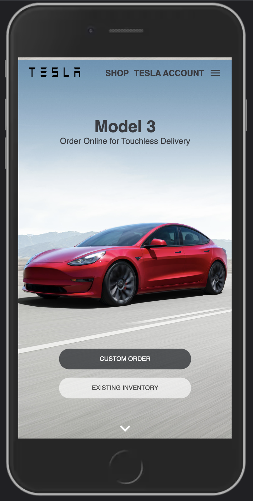
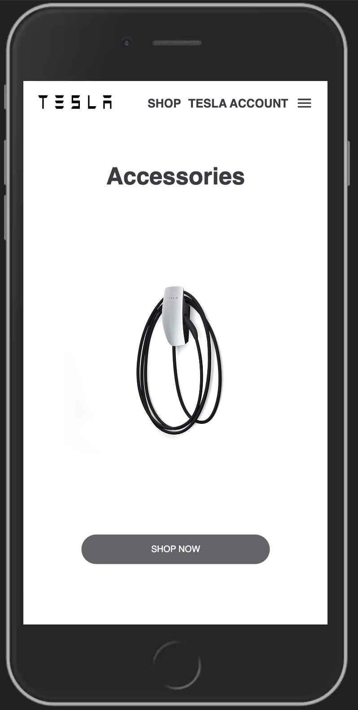
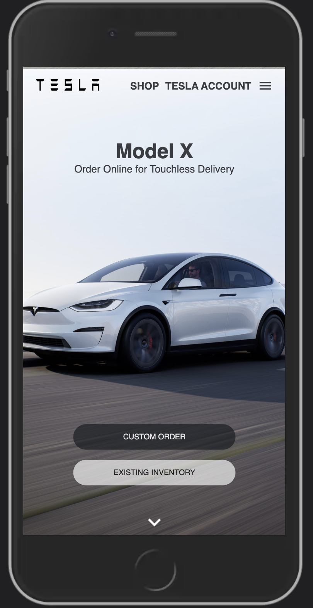

# Tesla
An app I wrote with React.
[Take a look, it's on Github pages](https://github.com/AmitDoanias/Tesla "Github pages link")


___

### Table of Contents
- [Description](#description)
- [Features](#features)
- [Getting started](#getting-started)
- [Showcase](#showcase)

## Description
a bit about the project - a small App that was built in a few hours with React.js

#### Technologies
- React Redux
- CSS
- Styled Components
- MUI Libary
- React CLI & Github pages

## Features
Please feel free to take a look of the different components of the website - [Showcase](#showcase)

- Responsive and well designed.

## Getting started
Clone the project or dowload the files on top.
```
git clone https://github.com/AmitDoanias/Tesla.git
```
Open the terminal and enter the following line to run it locally on your computer:
```
npm start
```
Runs the app in the development mode.
Open http://localhost:3000 to view it in the browser.


### Some mobile!


